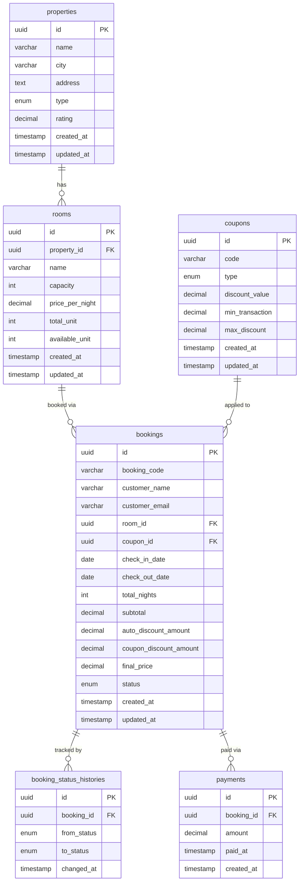

# Property Booking API

REST API backend untuk platform pemesanan properti (seperti Traveloka / Airbnb).

Dibangun menggunakan NestJS, TypeORM, dan PostgreSQL.

---

## Fitur

### Manajemen Properti & Kamar
- Tambah dan tampilkan daftar properti beserta tipe, kota, alamat, dan rating
- Filter properti berdasarkan kota, tipe, rating minimum, harga maksimum, kapasitas minimum, dan ketersediaan tanggal
- Cursor-based pagination pada daftar properti untuk performa yang scalable
- Tambah kamar ke properti dengan kapasitas, harga per malam, dan pelacakan jumlah unit

### Alur Booking
- Buat booking dengan validasi otomatis (keberadaan kamar, ketersediaan unit, rentang tanggal)
- Auto-discount 10% diterapkan saat menginap 3 malam atau lebih
- Dukungan kupon: tipe PERCENTAGE dengan batas maksimum diskon, dan tipe FIXED nominal tetap
- Kode booking unik digenerate untuk setiap transaksi (`BK-XXXXXXXX`)
- Pembayaran booking: mengubah status dari PENDING ke PAID dan mencatat record pembayaran
- Pembatalan booking: mengubah status dari PENDING ke CANCELLED dan mengembalikan unit yang tersedia
- Detail booking lengkap beserta room, property, coupon, dan status history dalam satu response

### Filter Ketersediaan
- Pengecekan ketersediaan secara real-time via subquery NOT EXISTS pada tanggal booking yang tumpang tindih
- Mengecualikan booking berstatus CANCELLED dan EXPIRED dari pengecekan tumpang tindih

### Audit & Integritas Data
- Tabel status history mencatat setiap perubahan status booking beserta timestamp-nya
- `available_unit` dikurangi saat booking dibuat (PENDING) untuk mencegah double-booking
- `available_unit` dikembalikan secara otomatis saat booking dibatalkan

### Developer Experience
- Swagger UI di `/docs` dengan dokumentasi endpoint dan schema yang lengkap
- Auto-seed data kupon saat aplikasi startup (idempotent)
- Global validation pipe dengan whitelist dan auto-transform
- Format response yang konsisten: `{ data, message, meta? }`
- Global HTTP exception filter untuk format error response yang seragam
- Dukungan Docker Compose: jalankan app + database hanya dengan satu perintah

---

## Tech Stack

- **Runtime**: Node.js
- **Framework**: NestJS + TypeScript
- **ORM**: TypeORM
- **Database**: PostgreSQL
- **Validation**: class-validator, class-transformer
- **Docs**: Swagger UI (`/docs`)

---

## Prasyarat

- Node.js >= 18
- Docker & Docker Compose

---

## Cara Menjalankan

### Option A — Local (app lokal + DB di Docker)

```bash
# 1. Install dependencies
npm install

# 2. Setup environment
cp env.example .env

# 3. Jalankan PostgreSQL
docker compose up postgres -d

# 4. Jalankan app
npm run start:dev

# 5. (Opsional) Seed data dummy — 20 properties + rooms
npm run seed
```

App: `http://localhost:3000`  
Swagger: `http://localhost:3000/docs`

---

### Option B — Full Docker (app + DB semua di container)

Tidak perlu install Node.js. Cukup Docker.

```bash
# 1. Setup environment
cp env.example .env

# 2. Build image dan jalankan semua service
docker compose up -d --build
```

Cek semua container berjalan:

```bash
docker compose ps
```

Output yang diharapkan:
```
NAME                    STATUS
postgres-dev            running
property-booking-api    running
```

App: `http://localhost:3000`  
Swagger: `http://localhost:3000/docs`

> App otomatis menunggu PostgreSQL siap sebelum start (`healthcheck`).  
> Jalankan `--build` setiap ada perubahan kode agar image ter-rebuild.

---

### Menghentikan Semua Service

```bash
docker compose down
```

---

> Database tables auto-generated saat pertama kali app dijalankan (`synchronize: true`).  
> Coupon seed data (NEWUSER10, STAYCATION50) otomatis di-insert saat startup.

---

## API Endpoints

### Properties

| Method | Endpoint | Keterangan |
|--------|----------|------------|
| POST | `/properties` | Tambah properti baru |
| GET | `/properties` | Daftar properti dengan filter + cursor pagination |
| GET | `/properties/:id` | Detail properti beserta daftar kamar |

**Parameter filter:** `city`, `type`, `minRating`, `maxPrice`, `minCapacity`, `checkInDate`, `checkOutDate`, `limit`, `cursor`

#### POST /properties
```bash
curl -X POST http://localhost:3000/properties \
  -H "Content-Type: application/json" \
  -d '{
    "name": "Grand Hyatt Jakarta",
    "city": "Jakarta",
    "address": "Jl. M.H. Thamrin No.28, Jakarta",
    "type": "HOTEL",
    "rating": 4.8
  }'
```
```json
{
  "data": {
    "id": "a1b2c3d4-...",
    "name": "Grand Hyatt Jakarta",
    "city": "Jakarta",
    "address": "Jl. M.H. Thamrin No.28, Jakarta",
    "type": "HOTEL",
    "rating": 4.8,
    "createdAt": "2026-06-26T10:00:00.000Z"
  },
  "message": "Property created successfully"
}
```

#### GET /properties (dengan filter)
```bash
# Filter by city, type, dan tanggal tersedia
curl "http://localhost:3000/properties?city=Jakarta&type=HOTEL&minRating=4&checkInDate=2026-07-01&checkOutDate=2026-07-04&limit=5"

# Halaman berikutnya menggunakan cursor dari response sebelumnya
curl "http://localhost:3000/properties?limit=5&cursor=eyJ0cyI6MTc..."
```
```json
{
  "data": {
    "properties": [...],
    "hasNextPage": true,
    "nextCursor": "eyJ0cyI6MTc..."
  },
  "message": "Properties fetched successfully"
}
```

#### GET /properties/:id
```bash
curl http://localhost:3000/properties/a1b2c3d4-...
```
```json
{
  "data": {
    "id": "a1b2c3d4-...",
    "name": "Grand Hyatt Jakarta",
    "rooms": [
      { "id": "r1...", "name": "Deluxe Room", "capacity": 2, "pricePerNight": 850000, "availableUnit": 5 }
    ]
  },
  "message": "Property fetched successfully"
}
```

---

### Rooms

| Method | Endpoint | Keterangan |
|--------|----------|------------|
| POST | `/properties/:propertyId/rooms` | Tambah kamar ke properti |
| GET | `/properties/:propertyId/rooms` | Daftar kamar milik suatu properti |

#### POST /properties/:propertyId/rooms
```bash
curl -X POST http://localhost:3000/properties/a1b2c3d4-.../rooms \
  -H "Content-Type: application/json" \
  -d '{
    "name": "Deluxe Room",
    "capacity": 2,
    "pricePerNight": 850000,
    "totalUnit": 10
  }'
```
```json
{
  "data": {
    "id": "r1b2c3d4-...",
    "name": "Deluxe Room",
    "capacity": 2,
    "pricePerNight": 850000,
    "totalUnit": 10,
    "availableUnit": 10
  },
  "message": "Room created successfully"
}
```

#### GET /properties/:propertyId/rooms
```bash
curl http://localhost:3000/properties/a1b2c3d4-.../rooms
```
```json
{
  "data": [
    { "id": "r1...", "name": "Deluxe Room", "capacity": 2, "pricePerNight": 850000, "availableUnit": 9 },
    { "id": "r2...", "name": "Suite Room", "capacity": 4, "pricePerNight": 1500000, "availableUnit": 3 }
  ],
  "message": "Rooms fetched successfully"
}
```

---

### Coupons

| Method | Endpoint | Keterangan |
|--------|----------|------------|
| POST | `/coupons` | Tambah kupon baru |
| GET | `/coupons` | Daftar semua kupon |
| GET | `/coupons/:id` | Detail kupon |

#### POST /coupons
```bash
curl -X POST http://localhost:3000/coupons \
  -H "Content-Type: application/json" \
  -d '{
    "code": "SUMMER20",
    "type": "PERCENTAGE",
    "discountValue": 20,
    "minTransaction": 400000,
    "maxDiscount": 150000
  }'
```
```json
{
  "data": {
    "id": "c1b2c3d4-...",
    "code": "SUMMER20",
    "type": "PERCENTAGE",
    "discountValue": 20,
    "minTransaction": 400000,
    "maxDiscount": 150000,
    "createdAt": "2026-06-27T08:00:00.000Z"
  },
  "message": "Coupon created successfully"
}
```

#### GET /coupons
```bash
curl http://localhost:3000/coupons
```
```json
{
  "data": [
    { "id": "...", "code": "NEWUSER10", "type": "PERCENTAGE", "discountValue": 10, "minTransaction": 500000, "maxDiscount": 100000 },
    { "id": "...", "code": "STAYCATION50", "type": "FIXED", "discountValue": 50000, "minTransaction": 300000, "maxDiscount": null }
  ],
  "message": "Coupons fetched successfully"
}
```

---

### Bookings

| Method | Endpoint | Keterangan |
|--------|----------|------------|
| POST | `/bookings` | Buat booking baru |
| GET | `/bookings/:id` | Detail booking beserta room, property, coupon, dan status history |
| POST | `/bookings/:id/pay` | Bayar booking (PENDING → PAID) |
| POST | `/bookings/:id/cancel` | Batalkan booking (PENDING → CANCELLED) |

#### POST /bookings
```bash
# Tanpa coupon
curl -X POST http://localhost:3000/bookings \
  -H "Content-Type: application/json" \
  -d '{
    "roomId": "r1b2c3d4-...",
    "customerName": "Budi Santoso",
    "customerEmail": "budi@example.com",
    "checkInDate": "2026-07-01",
    "checkOutDate": "2026-07-04"
  }'

# Dengan coupon (menginap 3 malam → auto discount 10% + coupon NEWUSER10)
curl -X POST http://localhost:3000/bookings \
  -H "Content-Type: application/json" \
  -d '{
    "roomId": "r1b2c3d4-...",
    "customerName": "Budi Santoso",
    "customerEmail": "budi@example.com",
    "checkInDate": "2026-07-01",
    "checkOutDate": "2026-07-04",
    "couponCode": "NEWUSER10"
  }'
```
```json
{
  "data": {
    "id": "bk001-...",
    "bookingCode": "BK-A1B2C3D4",
    "customerName": "Budi Santoso",
    "customerEmail": "budi@example.com",
    "checkInDate": "2026-07-01",
    "checkOutDate": "2026-07-04",
    "totalNights": 3,
    "subtotal": 2550000,
    "autoDiscountAmount": 255000,
    "couponDiscountAmount": 100000,
    "finalPrice": 2195000,
    "status": "PENDING"
  },
  "message": "Booking created successfully"
}
```

#### GET /bookings/:id
```bash
curl http://localhost:3000/bookings/bk001-...
```
```json
{
  "data": {
    "id": "bk001-...",
    "bookingCode": "BK-A1B2C3D4",
    "status": "PENDING",
    "room": { "name": "Deluxe Room", "pricePerNight": 850000 },
    "property": { "name": "Grand Hyatt Jakarta", "city": "Jakarta" },
    "coupon": { "code": "NEWUSER10", "type": "PERCENTAGE", "discountValue": 10 },
    "statusHistories": [
      { "fromStatus": null, "toStatus": "PENDING", "changedAt": "2026-06-26T10:00:00.000Z" }
    ]
  },
  "message": "Booking fetched successfully"
}
```

#### POST /bookings/:id/pay
```bash
curl -X POST http://localhost:3000/bookings/bk001-.../pay
```
```json
{
  "data": { "id": "bk001-...", "bookingCode": "BK-A1B2C3D4", "status": "PAID" },
  "message": "Booking paid successfully"
}
```

#### POST /bookings/:id/cancel
```bash
curl -X POST http://localhost:3000/bookings/bk001-.../cancel
```
```json
{
  "data": { "id": "bk001-...", "bookingCode": "BK-A1B2C3D4", "status": "CANCELLED" },
  "message": "Booking cancelled successfully"
}
```

---

## Booking Business Logic

### Alur Kalkulasi Harga

| # | Langkah | Formula |
|---|---------|---------|
| 1 | Validasi unit | `available_unit > 0` |
| 2 | Validasi tanggal | `check_out_date > check_in_date` |
| 3 | Total malam | `check_out_date - check_in_date` (dalam hari) |
| 4 | Subtotal | `price_per_night × total_nights` |
| 5 | Auto discount | `total_nights >= 3` → `subtotal × 10%`, selainnya `0` |
| 6 | Coupon discount | Lihat tabel Coupon Rules di bawah |
| 7 | Final price | `subtotal - auto_discount - coupon_discount` |
| 8 | Unit saat PENDING | `available_unit - 1` |
| 9 | Unit saat CANCELLED | `available_unit + 1` (dikembalikan) |

**Contoh kalkulasi** — menginap 3 malam @ Rp 850.000/malam + kupon `NEWUSER10`:

| Komponen | Nilai |
|----------|-------|
| Subtotal (850.000 × 3) | Rp 2.550.000 |
| Auto discount 10% | − Rp 255.000 |
| Coupon NEWUSER10 (10%, max 100k) | − Rp 100.000 |
| **Final Price** | **Rp 2.195.000** |

---

### Coupon Rules

| Code | Type | Discount | Min Transaksi | Max Discount |
|------|------|----------|---------------|--------------|
| `NEWUSER10` | PERCENTAGE | 10% dari subtotal | Rp 500.000 | Rp 100.000 |
| `STAYCATION50` | FIXED | Rp 50.000 flat | Rp 300.000 | — |

> Coupon di-seed otomatis saat aplikasi pertama kali dijalankan.

### Alur Status

```
PENDING ──► PAID
   │
   ├──────► CANCELLED  (available_unit dikembalikan)
   │
   └──────► EXPIRED    (available_unit dikembalikan, otomatis setelah 15 menit)
```

> Booking berstatus PAID tidak dapat dibatalkan. Tidak ada alur refund.

> Expiry menggunakan **lazy check**: status EXPIRED di-set saat endpoint `/pay` atau `/cancel` dipanggil pada booking yang sudah melewati batas waktu 15 menit. `available_unit` dikembalikan secara otomatis saat booking di-expire.

---

## Keputusan Desain

### 1. Cursor-based Pagination
Menggunakan cursor pagination pada `GET /properties` dibanding offset pagination.

**Alasan:** Offset pagination (`LIMIT 10 OFFSET 1000`) memaksa database untuk skip 1000 baris sebelum mengambil 10 baris — biaya O(n). Cursor menyimpan posisi (`created_at + id`) sehingga database menggunakan B-tree index untuk langsung loncat ke posisi tersebut — biaya O(log n). Jauh lebih efisien untuk dataset besar.

### 2. available_unit Dikurangi saat PENDING
Unit dikurangi langsung saat booking dibuat (status PENDING), bukan saat PAID.

**Alasan:** Mencegah double-booking. Jika dua user booking room yang sama secara bersamaan, hanya satu yang berhasil karena unit sudah dikurangi. Trade-off: unit "terblokir" sementara selama booking PENDING. Improvement: tambahkan expired job untuk auto-cancel booking PENDING setelah N menit.

### 3. synchronize: true Hanya di Development
TypeORM `synchronize: true` otomatis alter table berdasarkan entity. Aman untuk development, **berbahaya di production** karena bisa drop kolom yang tidak ter-mapping.

**Production approach:** Gunakan TypeORM migrations (`npm run migration:generate`, `migration:run`).

### 4. Status History Table
Setiap perubahan status booking dicatat di tabel `booking_status_histories`.

**Alasan:** Audit trail — bisa tahu kapan dan dari status apa suatu booking berubah. Berguna untuk debugging dan compliance.

### 5. QueryBuilder untuk Filter Kompleks
Filter property menggunakan TypeORM `QueryBuilder` bukan `find()` biasa.

**Alasan:** Filter melibatkan join ke tabel rooms, subquery untuk cek ketersediaan tanggal, dan kondisi dinamis yang tidak bisa direpresentasikan dengan `find()` option. QueryBuilder menghasilkan SQL yang dioptimasi dan aman dari SQL injection melalui parameterized query.

### 6. Database Index
Index ditambahkan pada kolom yang sering digunakan untuk filter dan join:
- `properties`: `city`, `type`, `rating`
- `rooms`: `property_id`, `available_unit`
- `bookings`: `room_id`, `status`

---

## Skema Database


